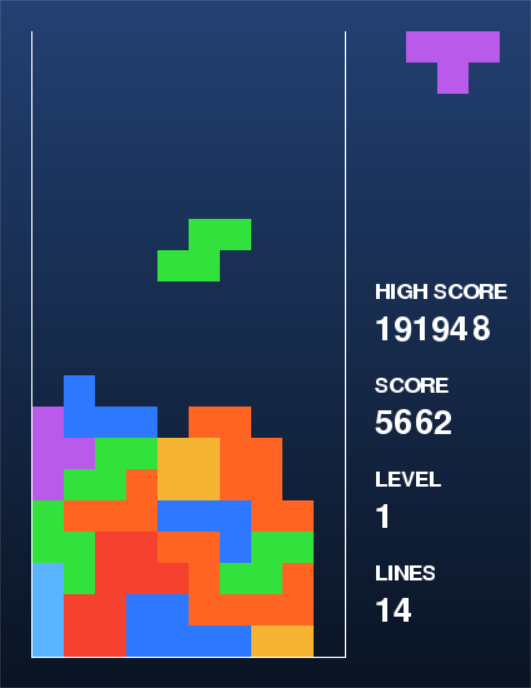

# AI Tetris


## Introduction
This is an implementation of Tetris featuring an AI trained using the Genetic Algorithm. The mechanics of the game are inspired by the 1989 NES release of Tetris.

## Installation
1. Clone this repository to your local machine using `https://github.com/jseok1/AI-Tetris.git`.
2. Use the package manager `pip` to install `pygame`.
```bash
$ pip install pygame
```

## Usage
To launch the game, simply run the `main.py` module.
```bash
$ python main.py [-h] [-a] [-l <level>]
```
Include the optional argument `-a` to enable the AI. By default, the game starts at level 0. To change this, include the optional argument `-l <level>` to start at a different level.


The controls are as follows.
* `LEFT` - Move the current Tetromino left.
* `RIGHT` - Move the current Tetromino right.
* `DOWN` - Move the current Tetromino down.
* `x` - Rotate the current Tetromino clockwise.
* `z` - Rotate the current Tetromino counterclockwise.
* `ENTER` - Pause or restart the game.

<!-- TODO: AI explanation, UML diagram -->
