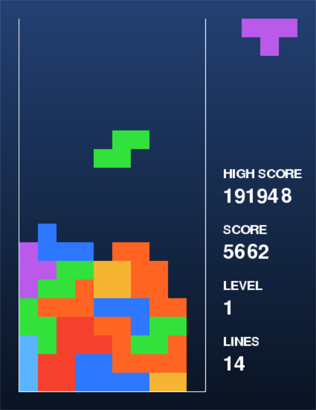

# AI Tetris



## Introduction

This is an implementation of Tetris featuring an AI trained using the Genetic Algorithm. Like the 1989 NES release, the game runs at 60 frames per second and features
mechanics like the standard rotation system and delayed auto shift (DAS).

## Usage

Install the dependencies in `requirements.txt`.

```bash
$ pip install -r requirements.txt
```

To launch the game, simply run `main.py`.

```bash
$ python3 main.py [-h] [-l LEVEL] [-a]

options:
  -h, --help            show this help message and exit
  -l LEVEL, --level LEVEL
                        initial level
  -a, --ai              run with an AI agent trained using reinforcement learning
```

Include the optional argument `-a` to enable the AI. By default, the game starts at level 0. To change this, include the optional argument `-l <level>` to start at a different level.

| Level | Frames |
| ----- | ------ |
| 0     | 48     |
| 1     | 43     |
| 2     | 38     |
| 3     | 33     |
| 4     | 28     |
| 5     | 23     |
| 6     | 18     |
| 7     | 13     |
| 8     | 8      |
| 9     | 6      |
| 10-12 | 5      |
| 13-15 | 4      |
| 16-18 | 3      |
| 19-28 | 2      |
| 29+   | 1      |

The controls are as follows.

- `LEFT` - Move the current Tetromino left.
- `RIGHT` - Move the current Tetromino right.
- `DOWN` - Move the current Tetromino down.
- `x` - Rotate the current Tetromino clockwise.
- `z` - Rotate the current Tetromino counterclockwise.
- `ENTER` - Pause or restart the game.

To retrain the AI, run `trainer.py`. The weights will be saved to `weights.txt` once training is finished.

```bash
$ python3 trainer.py
```

<!-- TODO: AI explanation, UML diagram -->
